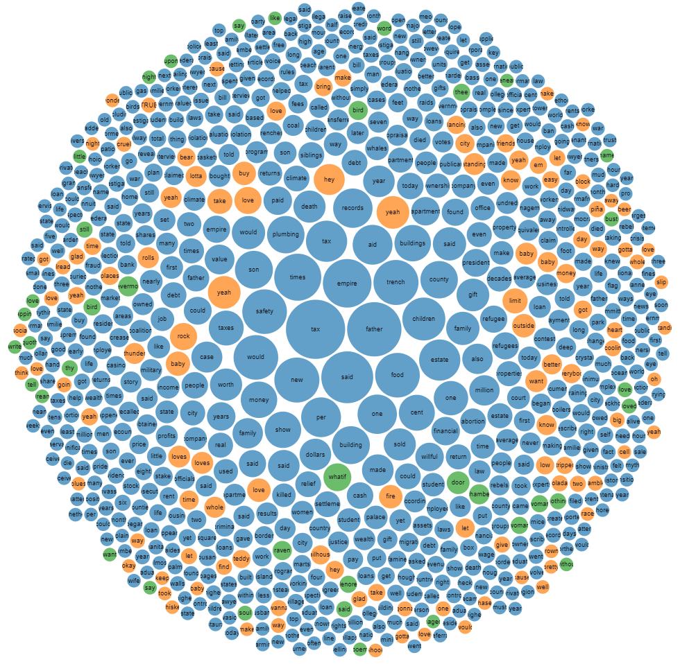
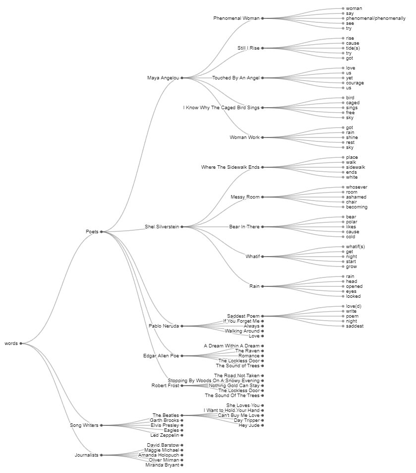

# Diversity of Diction

This project compares the vocabularies of representative works from three groups of creative writing.  Using tools such as Python and Beautiful Soup, we were able to answer general questions such as:

* Which form of creative writing appears to have the broadest vocabulary?

as well as specific questions such as:

* What are the most commonly used words among creative writing groups?  Authors?

# Getting Started / Prerequisites

# Sampling Data

The three groups of creative writing chosen for comparison were: Songwriters, Poets, and Journalists.  From these, we selected five of the most successful authors, and five of their works.

After selecting a sample of works, we set off to obtain the text for analysis.  This involved a process known as "web scraping."  We identified websites containing the text of the works that we were searching for, and utilized tools such as Beautiful Soup, Python, Urllib, and Requests to scrape the webpages and parse the HTML.

# Data Cleaning/Processing

With the text now at our disposal, we could make a plan to clean the text and extract our target data.  Below is a representation of how we used tools like RegEx to convert the blocks of text into a Python list of "regular expressions," NLTK's list of "stop words" to remove words that we considered unuseful, and NLP tasts such as converting all text to lowercase to combine otherwise identical words.  Note* This is an appropriate time to apply stemming and lemmatization.

The data was then loaded into a sqlite database.

# Analysis / Answering Our Questions

The process detailed above produces an organized data set that can be manipulated by the programming language of your choice for the purposes of analysis and visualization.

Using Python, pandas, and the graphing tool provided by ObservableHQ, we were able to create visualizations to display the answers to our questions.

1) Which form of creative writing appears to have the broadest vocabulary?

2) What are the most commonly used words among creative writing groups?  Authors?

